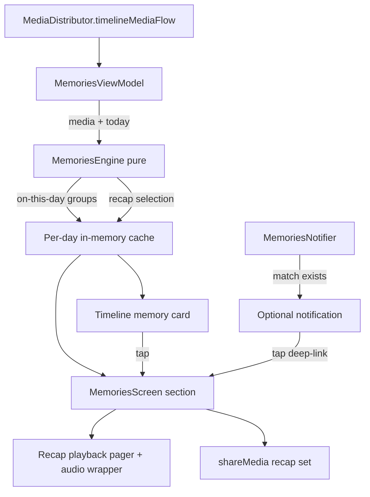

# On-Device Memories - Plan

## Goal Capsule

- **Objective:** Ship a dedicated on-device Memories experience: a Memories section with "On this day" memories and a story-style yearly recap with soundtrack, plus an in-app timeline card and an optional system notification when there's a match.
- **Product authority:** This plan owns only the on-device Memories area. People/face-grouping UX and Storycards enhancements are separate follow-up brainstorms, not active scope.
- **Execution profile:** `execution: code`; implementer is `ce-work` (or equivalent). Stop conditions and per-unit done signals live in Verification Contract and Definition of Done.
- **Open blockers:** none.

## Product Contract

> Product Contract preservation: unchanged from the brainstorm artifact (same R/AE/F IDs, no scope change).

### Summary

A dedicated Memories section shows "On this day" memories and a story-style yearly recap with soundtrack. An in-app timeline card and an optional off-by-default system notification surface today's memories at app open. Recap selection is deterministic and signal-weighted so it feels personal, not random.

### Key Decisions

- Hybrid compute (on-demand + per-day cache) over a precompute worker (session-settled: user-approved — chosen over a precompute worker: avoids re-introducing the worker family removed in Phase 5). Governs R2, R4.
- Memories section independent of the existing MEMORIES story card (session-settled: user-directed — chosen over card-links-to-section and replace-card: user wants both surfaces separate). Governs R1, R6.
- Heuristic auto-pick for recap content (session-settled: user-directed — chosen over user-curated and signal-boosted-only: deterministic, no ML). Governs R3, R4.
- Success criterion: the recap feels personal, not random (user-stated). Governs R3.

### Requirements

**Memories section**

- R1. A dedicated Memories section, reachable from app navigation, shows "On this day" memories from previous years and the yearly recap.
- R2. The Memories section computes its content on demand from the local timeline media flow and caches the result per day; no background worker.
- R3. The recap features photos selected by deterministic heuristics: favorites boosted, spread across months, photos preferred over screenshots and videos.
- R4. The same day and library always produce the same recap; it may change when the library changes or the date rolls over.
- R5. Recap playback supports a soundtrack from local assets only, silent by default with a user toggle.

**App-open surfacing**

- R6. When on-this-day matches exist, an in-app card appears on the timeline; tapping it opens the memory.
- R7. An optional system notification (default OFF) may announce today's memories; it respects the notification permission and never posts without it.

**Sharing**

- R8. The user can share the recap as a set of photos via the standard share sheet.

**Constraints**

- R9. The feature works fully offline and in noML builds: no network calls and no ML dependency anywhere in the memories path.
- R10. All user-facing strings go through Compose string resources with a `memories_` prefix.

### Key Flows

- F1. Open app to memory
  - **Trigger:** App launch with an on-this-day match.
  - **Steps:** Timeline shows the memory card; optional notification posts (if enabled and permitted); tapping either opens the memory view.
  - **Covers R2, R6, R7.**
- F2. Recap playback
  - **Trigger:** User opens the Memories section and picks a year.
  - **Steps:** Story-style pager plays featured photos with optional soundtrack; user swipes or taps to step.
  - **Covers R1, R3, R5.**
- F3. Share a recap
  - **Trigger:** User taps share during or after playback.
  - **Steps:** The full featured photo set is shared via the Android share sheet.
  - **Covers R8.**

### Acceptance Examples

- AE1. Covers R2, R4 — Given a library with 3+ photos from this day in prior years, opening the section twice in one day shows identical content.
- AE2. Covers R3 — Given a year with photos in 8 months including screenshots, the recap features photos across months and excludes screenshots when alternatives exist.
- AE3. Covers R6, R7 — Given notification permission denied or the toggle off, no system notification posts and the in-app card still works.
- AE4. Covers R9 — Given the offline flavor with no accounts, the Memories section works identically with no network access.
- AE5. Covers R1 — Given no on-this-day matches and no recap-eligible media, the section shows a polished empty state, not an error.

### Scope Boundaries

- ML-based selection (arcface/CLIP) — outside this plan; heuristics only.
- Any network fetch for memories or soundtrack — outside this product's identity (offline-first).
- People / face-grouping UX and Storycards enhancements — deferred to separate follow-up brainstorms.
- A general any-date calendar browser — deferred for later; the recap covers a full year only.

### Sources / Research

- Existing on-this-day story card logic to keep independent of: `app/src/main/kotlin/com/dot/gallery/feature_node/presentation/storycards/StoryCardsViewModel.kt` (`buildMemoryCards`, ~204-266).
- Route conflict: `Screen.MemoriesScreen` (`app/src/main/kotlin/com/dot/gallery/feature_node/presentation/util/Screen.kt:327`) is wired to the cloud Memories screen (`app/src/main/kotlin/com/dot/gallery/core/presentation/components/NavigationComp.kt:1552`); this plan adds a new route.
- Timeline source: `MediaDistributor.timelineMediaFlow` (`app/src/main/kotlin/com/dot/gallery/core/MediaDistributor.kt:66`).
- Preference patterns: `app/src/main/kotlin/com/dot/gallery/core/Settings.kt` (`STORY_CARDS_CONFIG` at 1168-1182), `app/src/main/kotlin/com/dot/gallery/core/util/SettingsExt.kt`.
- Navigation items: `app/src/main/kotlin/com/dot/gallery/core/presentation/components/AppBar.kt:88` (`rememberNavigationItems`).
- Notification primitives: `app/src/main/kotlin/com/dot/gallery/cloud/sync/CloudIndexProgressManager.kt:94-106` (channel + `hasPostPermission`), `app/src/main/kotlin/com/dot/gallery/feature_node/presentation/setup/pages/SetupPermissionsPage.kt:208-254`.
- Share: `Context.shareMedia(List<T>)` in `app/src/main/kotlin/com/dot/gallery/feature_node/presentation/util/ImageUtils.kt:342`.
- Story pager precedent: `app/src/main/kotlin/com/dot/gallery/feature_node/presentation/storycards/StoryViewerScreen.kt:82`.
- Audio gap: only video-centric ExoPlayer exists (`app/src/main/kotlin/com/dot/gallery/feature_node/presentation/mediaview/components/video/VideoPlayerViewModel.kt:129`); no audio-only playback today.

---

## Planning Contract

### Key Technical Decisions

- KTD1. New route `OnDeviceMemoriesScreen` (`on_device_memories_screen`, optional `year` argument) plus a routed `RecapPlaybackScreen` (required `year` argument, following the `StoryViewerScreen.cardId` precedent); the existing `memories_screen` route stays with the cloud Memories screen. Rationale: avoids breaking cloud Memories navigation, and the timeline card/notification need to open a specific year group.
- KTD2. Memories entry lives in the Library screen, plus deep-links from the timeline card and story card; no new top-level tab (session-settled: user-approved — chosen over a 4th bottom-bar tab: keeps core nav unchanged; Memories is periodic content).
- KTD3. Per-day cache is an `@Singleton` `MemoriesCache` (Hilt), not ViewModel state and not persisted to DataStore. Rationale: `MemoriesViewModel` is scoped per `NavBackStackEntry`, so the timeline card and notifier cannot share a ViewModel instance; a singleton cache gives every consumer the same engine output for the day. Recap stability is required within a day and a process; cross-restart recompute is acceptable and keeps invalidation trivial. Governs R2, R4.
- KTD4. Selection logic is a pure, testable engine (`MemoriesEngine`) separate from the ViewModel: input is a list of `Media.UriMedia` + a `Clock`-derived "today", output is on-this-day groups and the recap selection. Deterministic seeding uses year + media id. Governs R3, R4.
- KTD5. Soundtrack uses a single bundled local audio asset played by a small audio wrapper (ExoPlayer audio-only); silent by default, toggle in the recap player with an accessible on/off state (`Role.Switch`, state-announcing `contentDescription`) and a disabled state with explanation when the asset is absent. Governs R5.
- KTD6. Notification is a standalone `NotificationManager` post with a dedicated channel created lazily (channel copy from `memories_notification_*` strings), gated on `POST_NOTIFICATIONS` (API 33+) and a default-OFF DataStore toggle. Trigger: a date-keyed `LaunchedEffect` in `TimelineScreen`; a `memories_notification_last_posted_date` DataStore key prevents re-posting within the same day. Tap deep-links (registered `NavDeepLink` on the on-device route) with an `EXTRA_YEAR` payload, opening the section root when absent. Governs R7.
- KTD7. Engine compute runs off the main thread: the ViewModel pipeline applies `.flowOn(Dispatchers.Default)` before `stateIn`. Governs R2 (large-library jank safety).

### High-Level Technical Design

- `MemoriesEngine` is pure Kotlin (no Android imports beyond `Media`), enabling fast JVM unit tests.
- The `@Singleton` `MemoriesCache` owns the per-day cache and exposes section state; the ViewModel, timeline card, and notification all read the same engine output.
- Recap playback reuses the `HorizontalPager` pattern from `StoryViewerScreen` plus a new audio-only wrapper.

### Assumptions

- `timelineMediaFlow` emits the full timeline media list on subscription (verified: `StoryCardsViewModel` consumes it this way).
- Favorites are available as a media attribute or queryable set for the heuristic boost; if not, the favorites boost degrades to a no-op without changing determinism.
- One bundled soundtrack asset is acceptable for v1; sourcing is an implementation detail.

---

## Implementation Units

### U1. MemoriesEngine selection logic

- **Goal:** Pure deterministic engine for on-this-day matching and recap selection.
- **Requirements:** R3, R4 (per KTD4).
- **Dependencies:** none.
- **Files:**
  - `app/src/main/kotlin/com/dot/gallery/feature_node/domain/memories/MemoriesEngine.kt` (new)
  - `app/src/test/java/com/dot/gallery/feature_node/domain/memories/MemoriesEngineTest.kt` (new)
- **Approach:**
  1. Input: `List<Media.UriMedia>`, a "today" `Calendar`, favorites predicate.
  2. On-this-day: exact month/day match on `definedTimestamp` for prior years; ±3-day proximity fallback when fewer than 3 matches; group by year, newest first.
  3. Recap: per-month candidate pools excluding screenshots (by label/mime heuristics), photos over videos, favorites boosted, deterministic seeded pick per month, spread across months.
- **Patterns to follow:** `StoryCardsViewModel.buildMemoryCards` for date filtering; keep pure (no Android context).
- **Test scenarios:**
  - Exact month/day match across multiple years returns year groups sorted newest first.
  - Fewer than 3 exact matches triggers the ±3-day fallback; future-year media never matches.
  - Media from the current year with the same month/day is excluded from on-this-day groups (matching is restricted to prior years).
  - Recap with 12 populated months picks from every month; a month with only screenshots falls back to screenshots only when nothing else exists.
  - Favorites-boosted candidates outrank non-favorites with equal spread.
  - Same input + same "today" produces byte-identical selection (determinism, run twice).
  - Empty library and single-photo year produce empty/one-item results without exceptions.
  - Timezone-shifted "today" (e.g., UTC vs UTC+14) changes the match set accordingly.
- **Verification:** `MemoriesEngineTest` green; no Android framework dependency in the engine.

### U2. MemoriesViewModel + per-day cache

- **Goal:** ViewModel consuming `timelineMediaFlow`, running the engine, caching per local date in the shared `@Singleton` cache.
- **Requirements:** R1, R2, R4 (per KTD3, KTD7).
- **Dependencies:** U1.
- **Files:**
  - `app/src/main/kotlin/com/dot/gallery/feature_node/presentation/memories/MemoriesViewModel.kt` (new)
  - `app/src/main/kotlin/com/dot/gallery/feature_node/presentation/memories/MemoriesCache.kt` (new, `@Singleton`)
  - `app/src/test/java/com/dot/gallery/feature_node/presentation/memories/MemoriesViewModelTest.kt` (new)
- **Approach:**
  1. Mirror `StoryCardsViewModel` flow shape (Hilt `@Inject` of `MediaDistributor`, `MemoriesCache`, `Clock`).
  2. Apply `.flowOn(Dispatchers.Default)` before `stateIn` so engine compute never runs on the main thread.
  3. Cache engine output in `MemoriesCache` keyed by local date; on date change or library change, recompute; card and notifier observe the same cache flow.
  4. Expose section state: on-this-day groups, recap-per-year, loading, empty.
- **Patterns to follow:** `StoryCardsViewModel.kt:45-49`; `NavigationViewModel.kt:23` stateIn pattern.
- **Test scenarios:** Covers AE1.
  - Same-day repeated computation returns the cached selection instance.
  - Date rollover (injected fixed `Clock`) recomputes for the new date.
  - Library change (new media in flow) invalidates the cache and recomputes.
  - Empty media list yields an empty-state UI state, no crash. Covers AE5.
- **Verification:** ViewModel unit tests green with `MockedMediaDistributor` and a fixed clock.

### U3. On-device Memories screen + navigation

- **Goal:** Dedicated section UI: on-this-day groups, year recap list, recap playback pager, empty states; new route wired into navigation.
- **Requirements:** R1, R5 (playback UI), R10.
- **Dependencies:** U2, U6 (audio wrapper exists before playback screen is built and tested).
- **Files:**
  - `app/src/main/kotlin/com/dot/gallery/feature_node/presentation/memories/OnDeviceMemoriesScreen.kt` (new)
  - `app/src/main/kotlin/com/dot/gallery/feature_node/presentation/memories/RecapPlaybackScreen.kt` (new)
  - `app/src/main/kotlin/com/dot/gallery/feature_node/presentation/util/Screen.kt` (add `OnDeviceMemoriesScreen` route)
  - `app/src/main/kotlin/com/dot/gallery/core/presentation/components/NavigationComp.kt` (wire composables)
  - `app/src/main/kotlin/com/dot/gallery/feature_node/presentation/library/` (Library entry point — locate exact file during implementation)
  - `app/src/main/res/values/strings.xml` (`memories_` strings)
  - `app/src/test/java/com/dot/gallery/feature_node/presentation/memories/OnDeviceMemoriesScreenTest.kt` (new, Robolectric)
- **Approach:**
  1. Section screen: LazyColumn of year recap entries + on-this-day groups, with explicit UI states: `Loading` (progress placeholders), `Empty` (`memories_empty_title`/`memories_empty_body` + one primary action), `Error` (message + retry), and the normal content state.
  2. Recap playback: `HorizontalPager` story-style screen modeled on `StoryViewerScreen`, with a defined playback state machine — `Playing` (auto-advance), `Paused` (user swipe/tap pauses; tap center toggles), `Completed` (end-of-recap overlay with share/close) — plus soundtrack toggle overlay.
  3. End-of-recap: overlay action bar with 48dp share (`memories_share`) and close (`memories_close`) buttons, each with `contentDescription`, positioned to not overlap the photo.
  4. Empty state: `memories_empty_title`/`memories_empty_body` strings plus one primary action guiding the user onward.
  5. Accessibility: all interactive controls use minimum 48dp touch targets; pager pages expose `contentDescription` ("Year Y, photo N of M"); soundtrack toggle uses `toggleable` with `Role.Switch`; share/close buttons carry explicit `contentDescription` from `memories_` strings.
  6. Route registration and Library entry per KTD1/KTD2; the Library entry is a standard list item titled "Memories" in the library shortcuts grid (exact host file located during implementation).
- **Patterns to follow:** `cloud/ui/memories/MemoriesScreen.kt` scaffold/topbar; `StoryViewerScreen.kt` pager; `StoryCardsSettingsScreen` toggle UI.
- **Test scenarios:**
  - Empty state renders when no memories (Robolectric compose). Covers AE5.
  - Recap pager renders a single-photo year with swipes disabled and no crash.
  - Soundtrack toggle off by default; toggling off mid-playback stops audio immediately.
  - End-of-recap shows share and close affordances.
- **Verification:** Robolectric compose tests green; manual route navigation compiles via `assembleDebug`.

### U4. Timeline memory card + deep links

- **Goal:** In-app card above the timeline when on-this-day matches exist; tap opens the memory.
- **Requirements:** R6 (per F1).
- **Dependencies:** U2, U3.
- **Files:**
  - `app/src/main/kotlin/com/dot/gallery/feature_node/presentation/timeline/TimelineScreen.kt` (add card to `aboveGridContent`)
  - `app/src/main/kotlin/com/dot/gallery/feature_node/presentation/memories/components/MemoryCard.kt` (new)
  - `app/src/main/kotlin/com/dot/gallery/core/presentation/components/NavigationComp.kt` (deep-link handling)
- **Approach:**
  1. Card slot alongside `StoryCardsRow`; hidden when no match.
  2. Card navigates to the on-device memory route for the matched year group.
- **Patterns to follow:** `StoryCardsRow` insertion in `TimelineScreen.kt:296`.
- **Test scenarios:**
  - Card renders with match, hidden without. Covers AE3 (card half).
  - Tap navigates to the correct year group route.
- **Verification:** Robolectric test for card visibility + navigation; `assembleDebug` green.

### U5. Optional notification

- **Goal:** Default-OFF system notification for on-this-day matches, permission-safe, deep-linking into the section.
- **Requirements:** R7 (per AE3).
- **Dependencies:** U2, U3.
- **Files:**
  - `app/src/main/kotlin/com/dot/gallery/core/notifications/MemoriesNotifier.kt` (new)
  - `app/src/main/kotlin/com/dot/gallery/core/Settings.kt` (add `memories_notification_enabled`, default false)
  - `app/src/main/res/values/strings.xml` (`memories_notification_*`)
  - `app/src/test/java/com/dot/gallery/core/notifications/MemoriesNotifierTest.kt` (new, Robolectric)
- **Approach:**
  1. Lazy channel creation mirroring `CloudIndexProgressManager` pattern; `hasPostPermission()` guard on API 33+.
  2. Content: `memories_notification_title`/`memories_notification_body` strings, dedicated small icon, channel copy from `memories_notification_channel`.
  3. Trigger: a date-keyed `LaunchedEffect` in `TimelineScreen` calls the notifier once per day; a `memories_notification_last_posted_date` DataStore key gates re-posting within the same day.
  4. Post only when the engine reports a match and the toggle is on; tap PendingIntent uses an ACTION_VIEW deep link to the on-device route with an `EXTRA_YEAR` payload (section root when absent).
  5. No match → no post; permission revoked → no post, no crash.
- **Patterns to follow:** `CloudIndexProgressManager.kt:94-106`; `SetupPermissionsPage.kt:208-254`.
- **Test scenarios:**
  - Toggle off → no post even with permission. Covers AE3.
  - Permission denied → no post, no crash; in-app card unaffected. Covers AE3.
  - No match → no post.
  - Already posted today → no second post on next app open.
  - PendingIntent targets the on-device route with year payload, not the cloud Memories screen.
- **Verification:** Robolectric notification tests green; toggle default verified in DataStore test.

### U6. Soundtrack playback

- **Goal:** Local-asset audio for recap playback behind a toggle.
- **Requirements:** R5 (per KTD5).
- **Dependencies:** none (standalone wrapper; consumed by U3's playback screen).
- **Files:**
  - `app/src/main/kotlin/com/dot/gallery/feature_node/presentation/memories/audio/RecapAudioPlayer.kt` (new)
  - `app/src/main/res/raw/` (bundled asset; sourcing may defer — toggle ships disabled if absent)
- **Approach:**
  1. Small ExoPlayer audio-only wrapper: play bundled asset, loop, stop on toggle-off or pager exit.
  2. Silent by default; state survives slide changes until toggled off.
  3. Toggle is accessible: `toggleable` with `Role.Switch` and a state-announcing `contentDescription`; when the asset is missing, the toggle renders disabled with a `memories_soundtrack_unavailable` explanation string.
- **Patterns to follow:** `VideoPlayerViewModel` ExoPlayer setup (audio-only variant).
- **Test scenarios:**
  - Toggle on plays; toggle off mid-playback stops immediately and stays off for subsequent slides.
  - Missing asset → toggle disabled, no crash.
- **Verification:** Unit test for wrapper state machine; audio behavior on device deferred (no device in this environment).

### U7. Share recap as photo set

- **Goal:** Share the full featured recap set via the existing share pipeline.
- **Requirements:** R8.
- **Dependencies:** U3.
- **Files:**
  - `app/src/main/kotlin/com/dot/gallery/feature_node/presentation/memories/RecapPlaybackScreen.kt` (share affordance)
  - reuse `app/src/main/kotlin/com/dot/gallery/feature_node/presentation/util/ImageUtils.kt` (`shareMedia(List<T>)`)
- **Approach:** Share the full featured set (not visited slides); mixed MIME via existing overload wrapped in `Intent.createChooser`; when no handler resolves, show a `memories_share_no_app` snackbar/toast instead of a silent no-op.
- **Test scenarios:**
  - Share before/during/after playback passes the full set. Covers F3.
  - Mixed photo/video set produces correct MIME intent.
  - No share target → graceful handling, no crash.
- **Verification:** Unit tests for set assembly; chooser behavior deferred to device verification.

---

## Verification Contract

| Gate | Command | Applies |
|---|---|---|
| Build | `./gradlew assembleDebug` | always |
| Unit tests | `./gradlew testDebugUnitTest` | always, all green |
| Lint | `./gradlew lint` | no new issues beyond `lint-baseline.xml` |
| Offline/noML | no network/ML imports in `feature_node/memories/**`, `core/notifications/MemoriesNotifier.kt` | review gate per R9 |

- Engine tests (U1) and ViewModel tests (U2) are the primary regression net; Robolectric covers compose states (U3) and notification gating (U5).
- Device-deferred: actual notification posting, audio playback, share chooser, and route deep-link from a killed app — record in the phase report as deferred verification.

## Definition of Done

- All units U1–U7 complete with their test scenarios passing.
- `assembleDebug`, `testDebugUnitTest`, `lint` green per Verification Contract.
- No network or ML dependency in the memories path (R9) — verified by review + offline-flavor build.
- Existing MEMORIES story card and cloud Memories screen unchanged in behavior.
- No abandoned-attempt code left in the diff; deferred items documented in the phase report.
