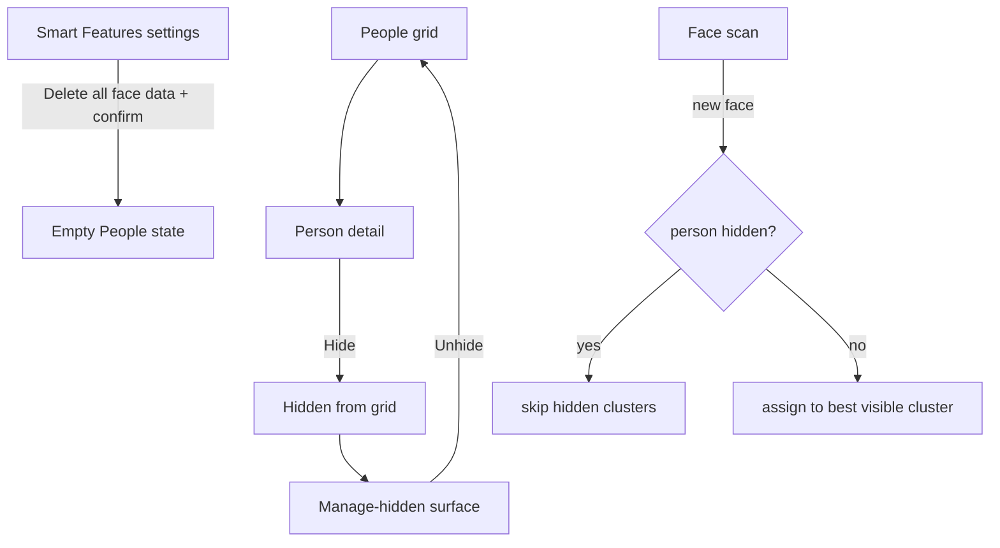
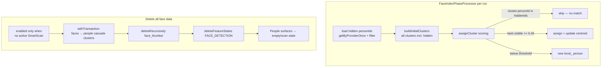

# People Hygiene - Plan

## Goal Capsule

- **Objective:** Close the irreversible and dead-end traps in the existing People feature — make hide reversible, make "ignore" actually stop clustering into a hidden person, add a delete-all-face-data control, and remove dead-ends (birthday chip, superseded indexer, stale person-detail screens).
- **Product authority:** This plan owns the People-hygiene area of Phase 6 only. Per-face correction, merge quality, viewer face overlays, and Storycards enhancements are not active scope.
- **Open blockers:** None.
- **Product Contract preservation:** Restructured, no scope change — R7 wording tightened to "all local people" (consistent with the local-only Key Decision; no remote provider writes `people` rows today). Added R13 — stale person-detail exit edge discovered during planning research.

## Product Contract

### Summary

Ship a People-hygiene pass: a manage-hidden surface with unhide, hidden persons frozen out of face clustering, a delete-all-face-data privacy control, and removal of dead ends — the local birthday chip, the superseded `FaceIndexerWorker`, and stale person-detail screens. Local (on-device) people only; nearly all DAO primitives needed already exist — one `media_feature_state` delete-by-feature query is added in U1.

### Problem Frame

The People feature already detects faces, clusters them into persons, and offers rename/merge/hide/blur actions. But three of its affordances are traps. Hide is one-way: `setHidden` has exactly one call site and it only ever sets `hidden = true`, so a hidden person can never be brought back in-app. Ignore — the user-facing meaning of hiding a person — is leaky: cluster matching in `FaceIndexPhaseProcessor` never checks the `hidden` flag, so a person the user tried to ignore keeps silently absorbing new faces. And face data is orphaned: deleting the face models leaves people, embeddings, and face thumbnails behind, with no control to purge them. On top of that, the birthday chip on local persons dead-ends into an unsupported provider call, a legacy `FaceIndexerWorker` — cancelled at every startup, superseded by the SmartScan path — still ships as dead code, and a person-detail screen left open when its person disappears (merge today, delete-all after this plan) sits on a stale media grid.

### Key Decisions

- **Hygiene over correction** (session-settled: user-directed — chosen over per-face correction and merge-quality work: user asked for a viable, easy scope). Governs Scope Boundaries.
- **Ignore means freeze** (session-settled: user-approved — hidden persons stop attracting faces, accepting that a rescan may spawn a new visible cluster for the same real face). Governs R4, R5, R6.
- **Local people only** (session-settled: user-approved — Immich naming and hidden state stay server-side as today; no provider changes). Governs R1–R6.
- **Hide the local birthday chip** (session-settled: user-approved — cheapest fix over storing birthdays locally). Governs R9.

### Requirements

**Hidden people management**

- R1. A manage-hidden surface lists every hidden local person (face thumbnail, name or fallback label, face count) and is reachable from the People area, following the ignored-albums management pattern.
- R2. Each hidden person can be unhidden from that surface; an unhidden person reappears in the People grid and person detail.
- R3. After the user hides a person, a path back is offered (e.g., snackbar action or the manage-hidden entry point) so the action is never a silent one-way door.

**Ignore semantics**

- R4. Hidden persons are excluded from cluster matching during face indexing; a newly scanned face is never assigned to a hidden person.
- R5. Unhiding a person restores cluster matching, so subsequent scans may add faces to that person again.
- R6. Hiding changes visibility only — the person's faces, name, and thumbnail are preserved for unhide; nothing is deleted.

**Face-data privacy**

- R7. A "Delete all face data" control removes all local people, detected faces, face clusters, and stored face thumbnails, behind a confirmation that states the consequence.
- R8. After deletion, People surfaces show their empty/scan states and face indexing can rebuild cleanly on the next scan.

**Dead-end removal**

- R9. The birthday action is not offered for local persons — no dead-end actions on person detail; remote-provider persons keep the action where supported.
- R10. The superseded `FaceIndexerWorker` and its scheduling hooks are removed; the SmartScan `FACE_INDEX` phase remains the only face-indexing path.
- R13. When a person no longer exists (delete-all, merge), an open person-detail screen exits or shows an explicit unavailable state instead of sitting on a stale media grid.

**Cross-cutting**

- R11. Manage-hidden and delete-data work without face models downloaded — they operate on stored data, so noML/offline builds and model-deleted states behave correctly.
- R12. All new strings go through string resources for Crowdin; new UI follows existing list/confirmation patterns and Compose semantics for accessibility.

### Key Flows

- F1. Hide → manage → unhide
  - **Trigger:** User hides a person from person detail.
  - **Steps:** Person leaves the People grid; user opens the manage-hidden surface; user unhides; person returns with name, faces, and thumbnail intact.
  - **Covers R1, R2, R3, R6**
- F2. Ignore then rescan
  - **Trigger:** A person is hidden and a face scan runs.
  - **Steps:** Cluster matching skips the hidden person; the same real face may form a new visible cluster — accepted consequence of "ignore means freeze".
  - **Covers R4, R5**
- F3. Delete all face data
  - **Trigger:** User opens Smart Features settings and chooses delete-all.
  - **Steps:** Confirmation states the consequence; on confirm, local people, detected faces, clusters, and face thumbnails are purged; People surfaces show empty/scan states.
  - **Covers R7, R8**

### Acceptance Examples

- AE1. **Covers R4.** Given a hidden person, when a new photo of that person is indexed, then the face is not added to the hidden person's cluster.
- AE2. **Covers R2, R5, R6.** Given a hidden person with a name and faces, when the user unhides them, then they reappear in the People grid with name, faces, and thumbnail intact, and later scans may add faces again.
- AE3. **Covers R7, R8.** Given face data exists, when the user confirms delete-all, then all local people, detected-face, and face-cluster data and face thumbnails are gone and the People section shows its scan/empty state.
- AE4. **Covers R9.** Given a local person's detail screen, then no birthday action is shown; an Immich person still shows it.
- AE5. **Covers R11.** Given no face models downloaded, when the user opens manage-hidden or delete-all, then both operate on stored data without errors.
- AE6. **Covers R13.** Given an open person-detail screen whose person is deleted or merged away, then the screen exits or shows an explicit unavailable state rather than stale media.

<!-- ce-section: work-relationships -->
### How This Work Fits Together

This plan owns the People-hygiene area of Phase 6 — the second of two queued brainstorms remains separate. The breakdown below is the current understanding, not a committed roadmap.

- Storycards enhancements — the other Phase 6 brainstorm candidate. Can proceed independently of this plan.
- Per-face correction ("this isn't X", cluster splitting) — deferred candidate; shares the person-detail surface this plan touches. `DetectedFaceDao.assignFace` exists unused.
- Merge quality (similarity-ranked candidates, centroid recompute, undo) — deferred candidate; independent of the hygiene work.
- Wider reach (face overlays in media viewer, person-aware search) — still to decide whether it belongs in a future People plan.

### Scope Boundaries

**Deferred for later**

- Per-face correction and cluster splitting.
- Merge-quality improvements (candidate ranking, centroid recompute, undo).
- Immich/remote person management beyond what exists today.
- Face overlays in the media viewer; person-aware semantic search.
- Linking face-model deletion to the delete-all-face-data control (decided independent — the settings control is the single surface).

**Outside this product's identity**

- Cloud-synced people data for the local provider — local people stay on-device.

### Dependencies / Assumptions

- DAO primitives exist and were verified: `PersonDao.getByProvider`/`getByProviderOnce`/`getVisibleByProvider`/`deleteByProvider`/`setHidden`/`deleteAll`, `DetectedFaceDao.deleteAll`, unused `assignFace`.
- `FaceIndexPhaseProcessor` (`SmartScanPhaseProcessor.kt`) is the live indexing path; `FaceIndexerWorker` is cancelled at startup and superseded.
- Ignored-albums management (`feature_node/presentation/ignored/`) is the established pattern for a hidden-items surface.
- `LocalPeopleProvider.isAvailable` gates on `FACE_DETECT` model readiness and `getAllPeople` filters unavailable providers — manage-hidden must read `PersonDao` directly to satisfy R11.
- Assumption: the user's actual pain is the irreversible/leaky traps — user delegated scope choice ("viable and easy"); recorded as an assumption, not probed evidence.

### Outstanding Questions

- **Deferred to Implementation:** Exact composable/method names for the hidden-people row item and purge helper.
- **Deferred to a later People polish:** Whether "unhide, then existing merge" is acceptable remediation for ignore-then-rescan duplicates — merge is only offered when another visible local person exists, so a lone duplicate cluster pair may be un-mergeable today.

### Sources / Research

- `app/src/main/kotlin/com/dot/gallery/cloud/data/dao/PersonDao.kt` — `getByProvider` (incl. hidden, unused), `getByProviderOnce`, `deleteByProvider`, `setHidden`, `deleteAll`.
- `app/src/main/kotlin/com/dot/gallery/cloud/data/dao/DetectedFaceDao.kt` — `deleteAll`, unused `assignFace`.
- `app/src/main/kotlin/com/dot/gallery/cloud/local/LocalPeopleProvider.kt` — `setHidden` wrapper (Boolean param, no change needed); `isAvailable` model gate; `updatePersonBirthDate` Unsupported.
- `app/src/main/kotlin/com/dot/gallery/core/smart/SmartScanPhaseProcessor.kt` — `FaceIndexPhaseProcessor`, `buildInitialClusters`, `assignCluster`, `persistClusterRows`/`emptyClusterIds`, `isCurrentFaceDetection`, `face_thumbs` dir.
- `app/src/main/kotlin/com/dot/gallery/feature_node/presentation/ignored/` — ignored-albums management pattern (`IgnoredScreen`/`IgnoredViewModel`/`removeFromBlacklist`).
- `app/src/main/kotlin/com/dot/gallery/feature_node/presentation/settings/subsettings/SettingsSmartFeaturesScreen.kt` — `settings{}` DSL; `enabled = activeSmartScan == null` gating precedent.
- `app/src/main/kotlin/com/dot/gallery/cloud/ui/people/` — `PeopleListScreen` (TopAppBar `actions` slot), `PersonDetailScreen`/`PersonDetailViewModel` (chips, `hidePerson`, `isLocalPerson`).
- `app/src/main/kotlin/com/dot/gallery/core/workers/FaceIndexerWorker.kt` + `GalleryApp.kt` — dead worker cancelled at startup.
- `app/src/main/kotlin/com/dot/gallery/feature_node/data/data_source/SmartScanDao.kt` — `media_feature_state` queries; no delete-by-feature yet.

---

## Planning Contract

### Key Technical Decisions

- KTD1. **Manage-hidden reads `PersonDao` directly.** The hidden-people list and unhide path inject `PersonDao`/`DetectedFaceDao` (both `@Provides`-injectable via `CloudModule`) rather than routing through `CloudRepository`/providers, because `LocalPeopleProvider.isAvailable` and `getAllPeople`'s provider filter make every local person invisible when face models are absent. Governs R1, R2, R11.
- KTD2. **Dual entry points, no snackbar-undo.** Manage-hidden is reachable from (a) a `PeopleListScreen` TopAppBar action shown when hidden persons exist and (b) a Smart Features settings `Preference` — the settings entry is the always-reachable path (Library's People row vanishes when all persons are hidden or models are deleted). R3's "path back" is satisfied by the discoverable entries; a post-hide snackbar is rejected — it needs a hoisted `SnackbarHostState` on the destination screen for marginal gain. Governs R1, R3.
- KTD3. **Hidden exclusion at scoring time, with carry-forward on reprocessing.** `FaceIndexPhaseProcessor` snapshots hidden personIds once per run (`getByProviderOnce` + filter) and skips those clusters inside `assignCluster`'s scoring loop. Hidden clusters stay in the active list so `persistClusterRows`/`emptyClusterIds` never deletes their rows — preserving centroids for unhide (R6). Faces already assigned to a hidden person keep that personId through reprocessing too (full refresh, processor-revision bump, edited timestamps, FAILED retries): hidden-owned faces are not drained via `removeFromClusters` and re-bind to their prior personId instead of re-scoring — otherwise a reprocess would empty every hidden person into a name-only shell, falsifying R6. Only *new* assignments to hidden clusters are blocked. Re-merge path for the duplicate-cluster consequence: unhide, then existing merge. Governs R4, R5, R6.
- KTD4. **Purge is atomic, unfiltered-scan-gated, state-resetting, and backup-aware.** One `withTransaction` runs `faceDao.deleteAll()` + `personDao.deleteByProvider(LOCAL_PEOPLE)` (`face_clusters` cascades) + `smartScanDao.deleteFeatureStates(FACE_DETECTION)` — the state reset must be inside the transaction because `isCurrentFaceDetection` treats `SUCCEEDED` rows with empty face headers as current; a crash between commits would permanently block re-indexing (R8). The `face_thumbs` wipe runs after the commit and its result is checked. The control is gated on the *unfiltered* `smartScanDao.observeActiveRun()` — not the `shouldShowRun`-filtered `activeSmartScan` StateFlow, which reports null for queued automatic runs — and `deleteAllFaceData()` re-checks `getActiveRun()` at action time. `face_thumbs/` is excluded from Android backup/transfer rules so a restore can't resurrect purged data; purge is documented as device-local (pre-purge backups are out of reach). Governs R7, R8.
- KTD5. **Worker removal keeps the startup cancel.** `FaceIndexerWorker` is deleted with its enqueue helper and stale KDoc references, but `GalleryApp`'s startup `cancelUniqueWork("FaceIndexer")` entry stays — existing installs may still have it queued; unresolvable work would otherwise linger. Governs R10.
- KTD6. **Birthday chip gated on loaded remote person.** The chip renders only when `person != null && !isLocalPerson` — during load (`person == null`) `isLocalPerson` is false, so an unguarded check would flash the chip for local persons. Governs R9.

### High-Level Technical Design

### Assumptions

- `InternalDatabase` is injectable (or reachable via an existing injected repository/scheduler) for `withTransaction`; if not, the purge composes the same DAO calls sequentially — the ordering, not the wrapper, is the contract.
- Mid-scan hide/unhide uses the per-run snapshot (KTD3); toggles mid-scan apply next run — documented, not synchronized.

---

## Implementation Units

### U1. Face-state reset primitive

**Goal:** Add the `media_feature_state` delete-by-feature query needed so a purge lets indexing rebuild.

**Requirements:** R7, R8, KTD4

**Dependencies:** none

**Files:**
- `app/src/main/kotlin/com/dot/gallery/feature_node/data/data_source/SmartScanDao.kt` (add `deleteFeatureStates(feature: MediaFeature)`)
- `app/src/test/java/com/dot/gallery/feature_node/data/data_source/` — new Robolectric DAO test (e.g. `SmartScanDaoFeatureStateTest.kt`) per the `ImageEmbeddingDaoTest` pattern: `AndroidJUnit4` + in-memory `InternalDatabase` + `runTest`. An instrumented `androidTest` variant would not run under the unit-test gate; keep the new coverage on the JVM.

**Approach:**
1. Add `@Query("DELETE FROM media_feature_state WHERE feature = :feature") suspend fun deleteFeatureStates(feature: MediaFeature)` alongside the existing feature-state queries.
2. No other DAO changes: `personDao.getByProvider`/`getByProviderOnce` cover hidden-list and hidden-snapshot needs; `personDao.deleteByProvider` covers scoped purge; `faceDao.deleteAll` covers faces.

**Patterns to follow:** existing `SmartScanDao` query style; `ImageEmbeddingDaoTest` (Robolectric, in-memory `InternalDatabase`, `runTest`).

**Test scenarios:**
- Seed `media_feature_state` rows for `FACE_DETECTION` and another feature; call `deleteFeatureStates(FACE_DETECTION)`; assert face rows gone, other-feature rows intact.
- Empty table → call is a no-op (no error).

**Verification:** New query covered by a DAO test; `./gradlew :app:testUniversalNoMLDebugUnitTest` green.

### U2. Hidden-cluster exclusion in face indexing

**Goal:** Hidden persons stop attracting new faces while keeping their cluster data.

**Requirements:** R4, R5, R6, KTD3

**Dependencies:** none

**Files:**
- `app/src/main/kotlin/com/dot/gallery/core/smart/SmartScanPhaseProcessor.kt` (`FaceIndexPhaseProcessor`)
- `app/src/test/java/com/dot/gallery/core/smart/` — extend or add a processor test file (pattern: `SmartScanPlanTest`, `EmbeddingValidationTest`)

**Approach:**
1. At run start in `FaceIndexPhaseProcessor.process`, load hidden personIds via `personDao.getByProviderOnce(ProviderType.LOCAL_PEOPLE).filter { it.hidden }` into an immutable `Set<String>`.
2. Extract the hidden check as an `internal fun` (e.g., `isHiddenCluster(cluster, hiddenIds)` or a `visibleClusters(clusters, hiddenIds)` filter) next to existing internal helpers so it is unit-testable without the full processor.
3. In `assignCluster`'s scoring loop, skip clusters whose `personId` is in the hidden set — below-threshold faces fall through to the existing new-`local_*`-person path.
4. Carry-forward on reprocessing (KTD3, required for R6): when media is reprocessed (`fullRefresh`, revision bump, changed source, FAILED retry), faces whose prior `personId` is hidden must not be drained into new visible persons. Skip hidden-owned faces in `removeFromClusters` and re-bind them to their prior `personId` after re-detection instead of re-scoring — e.g., preserve the existing `DetectedFaceEntity` rows for hidden-owned faces past `deleteByMedia`, or carry a prior-personId map through the re-detect. Either shape is acceptable; the contract is that the hidden cluster's count and row survive a full rescan and `updateFaceCount` does not zero the person.
5. Do not remove hidden clusters from `clusters` — `persistClusterRows`/`emptyClusterIds` must keep their `FaceClusterEntity` rows (KTD3). `removeFromClusters` already no-ops safely for them.
5. Mid-scan hide/unhide: snapshot semantics — changes apply next run (documented assumption).

**Patterns to follow:** `SmartScanPhaseProcessor.kt` internal-helper extraction convention; test style of `SmartScanPlanTest`/`EmbeddingValidationTest`.

**Test scenarios:**
- Covers AE1. Given hiddenIds contains person P, a face scoring above `CLUSTER_THRESHOLD` only against P's cluster is not assigned to P — it creates or joins a visible cluster.
- Given an empty hiddenIds set, matching behaves exactly as today (no regression).
- Hidden cluster remains in the clusters list after filtering — `persistClusterRows` does not delete its row (guard the `emptyClusterIds` path).
- Covers R5. After unhide (personId absent from hiddenIds), a matching face assigns to the previously hidden cluster again.
- Covers R6. Reprocessing a media whose faces belong to a hidden person (full refresh path, not adoption) leaves those faces on the hidden person — faceCount unchanged, cluster row intact.
- Prior faces on a hidden person are untouched — neither adoption nor reprocessing reassigns them (R6).

**Verification:** Unit tests green; no behavior change when no hidden persons exist.

### U3. Manage-hidden screen, ViewModel, and entry points

**Goal:** A screen listing hidden local persons with per-person unhide, reachable from People surfaces and Smart Features settings.

**Requirements:** R1, R2, R3, R11, R12, KTD1, KTD2

**Dependencies:** none (DAO primitives already exist)

**Files:**
- `app/src/main/kotlin/com/dot/gallery/feature_node/presentation/people/HiddenPeopleScreen.kt` (new) — or `cloud/ui/people/` if co-location with `PeopleListScreen` is preferred; pick one, follow the ignored screen's structure
- `app/src/main/kotlin/com/dot/gallery/feature_node/presentation/people/HiddenPeopleViewModel.kt` (new)
- `app/src/main/kotlin/com/dot/gallery/feature_node/presentation/util/Screen.kt` (`data object HiddenPeopleScreen : Screen("hidden_people_screen")`)
- `app/src/main/kotlin/com/dot/gallery/core/presentation/components/NavigationComp.kt` (composable wiring)
- `app/src/main/kotlin/com/dot/gallery/cloud/ui/people/PeopleListScreen.kt` + `PeopleListViewModel.kt` (TopAppBar action when hidden persons exist)
- `app/src/main/kotlin/com/dot/gallery/feature_node/presentation/settings/subsettings/SettingsSmartFeaturesScreen.kt` (Preference entry)
- `app/src/main/res/values/strings.xml` (new `hidden_people_*` keys)
- `app/lint-baseline.xml` (MissingTranslation entries — regenerate or hand-add per convention)

**Approach:**
1. `HiddenPeopleViewModel` injects `PersonDao` directly (KTD1): `getByProvider(LOCAL_PEOPLE).map { list -> list.filter(PersonEntity::hidden) }` → state flow; `unhide(personId)` → `personDao.setHidden(personId, false)` in `viewModelScope`.
2. `HiddenPeopleScreen` mirrors `IgnoredScreen`: `LargeTopAppBar` + `NavigationBackButton`, `LazyColumn` + `settings{}` rows — person row shows face thumbnail (`PersonEntity.thumbnailUrl` URI icon per `SettingsEntity.Preference.iconUri`, with a person-icon placeholder on a tinted container when `thumbnailUrl` is null or stale — the `PersonGridItem` placeholder convention), name or `cloud_people_unknown` fallback, face count; single-tap unhide action (no multi-step options sheet, no FAB).
3. Empty state: icon + title-style text like `NoIgnoredAlbums`, plus an explainer line. The empty state renders until the first `getByProvider` emission arrives (matching IgnoredScreen) — the brief initial-empty flash is accepted, not a loading branch.
4. Register `Screen.HiddenPeopleScreen` near `IgnoredScreen`; wire `composable(route = Screen.HiddenPeopleScreen())` in `NavigationComp` — no nav args.
5. PeopleListScreen entry: second `IconButton` in the existing TopAppBar `actions` slot, `eventHandler.navigate(Screen.HiddenPeopleScreen())`, visible when the VM's hidden-count flow > 0 (collect `personDao` hidden count in `PeopleListViewModel` — not the provider path). Icon: `Icons.Outlined.VisibilityOff` (the hide affordance's glyph) with a `hidden_people_*` contentDescription string resource.
6. Settings entry: `Preference` under a new dedicated "People" `Header` in `SettingsSmartFeaturesScreen`, placed outside the `if (aiAvailable)` block so it survives model-deleted state (R11); strings resolved before the non-composable `settings{}` DSL per file convention.
7. Person rows are unhide-only affordances — they do not open `PersonDetailScreen` (it can't resolve hidden persons).

**Patterns to follow:** `IgnoredScreen.kt`/`IgnoredViewModel.kt` structure; `SettingsSmartFeaturesScreen` string-resolution convention; `cloud_people_unknown` fallback string.

**Test scenarios:**
- Covers AE2. Hidden person unhidden via VM → `setHidden(id, false)` → person reappears in `getVisibleByProvider` results.
- Given zero hidden persons, the screen renders the empty state; the PeopleListScreen action is absent.
- Covers AE5. Hidden list populates and unhide works with `LocalPeopleProvider.isAvailable == false` — the flow never touches the provider.
- Robolectric DAO test: `getByProvider` + hidden filter returns only hidden persons; `setHidden(false)` round-trips visibility.
- Compose UI test (Robolectric, `TimelineFilterChipAccessibilityTest` pattern): unhide row has `contentDescription` / adequate touch target (R12).

**Verification:** Screen navigable from both entries; unhide propagates to People grid without manual refresh (Room Flow reactivity).

### U4. Delete-all face data control

**Goal:** Settings action that purges all local face data behind a consequence-stating confirmation.

**Requirements:** R7, R8, R11, R12, KTD4

**Dependencies:** U1 (`deleteFeatureStates`)

**Files:**
- `app/src/main/kotlin/com/dot/gallery/feature_node/presentation/settings/subsettings/SettingsSmartFeaturesScreen.kt` (Preference + `AlertDialog`)
- `app/src/main/kotlin/com/dot/gallery/feature_node/presentation/settings/subsettings/SmartFeaturesViewModel.kt` (inject `PersonDao`, `DetectedFaceDao`, `SmartScanDao`, `InternalDatabase`, `Context`; add purge)
- `app/src/main/res/xml/backup_rules.xml`, `app/src/main/res/xml/data_extraction_rules.xml` (`face_thumbs/` exclusions)
- `app/src/main/res/values/strings.xml`
- `app/lint-baseline.xml`

**Approach:**
1. `Preference` under the new "People" header (U3 step 6): title "Delete all face data", summary stating people/detections/thumbnails are removed; `enabled` on the *unfiltered* `smartScanDao.observeActiveRun()` emitting null — not the `shouldShowRun`-filtered `activeSmartScan` StateFlow, which misses queued automatic runs (KTD4).
2. Confirmation `AlertDialog` per `AIModelsManagerScreen.kt` pattern: consequence text, destructive-colored confirm, cancel.
3. `SmartFeaturesViewModel.deleteAllFaceData()`: re-check `smartScanDao.getActiveRun() == null` at action time and abort if a run is active; then `withTransaction { faceDao.deleteAll(); personDao.deleteByProvider(LOCAL_PEOPLE); smartScanDao.deleteFeatureStates(MediaFeature.FACE_DETECTION) }` — the state reset stays inside the transaction so a mid-purge crash can't leave media permanently marked indexed; `face_clusters` cascades via FK. After commit: `File(context.filesDir, "face_thumbs").deleteRecursively()` with the result checked — verify the dir is absent and surface a failure Toast if not.
4. UX states: disable the Preference while the purge is in flight; on completion surface a success Toast, on failure the `toastError` convention in `ContextExt.kt` (wrap the purge steps in try/catch). Settings screens use Toasts, not snackbars.
5. Backup residue: add `<exclude domain="file" path="face_thumbs/"/>` to `backup_rules.xml` (`full-backup-content`) and to `data_extraction_rules.xml` under both `cloud-backup` and `device-transfer` so a restore can't resurrect purged thumbnails; document purge as device-local (KTD4).
6. Works with models absent (R11): pure DAO/file operations, no model or provider calls.

**Patterns to follow:** `AIModelsManagerScreen`/`EditBackupsViewerScreen` AlertDialog; `SmartFeaturesViewModel` injected-DAO + StateFlow style.

**Test scenarios:**
- Covers AE3. Seed people + detected_faces + face_clusters + a `face_thumbs` file; purge → all tables empty for `LOCAL_PEOPLE`, thumbs dir gone.
- `media_feature_state` `FACE_DETECTION` rows cleared; other features' rows survive.
- Control disabled while an unfiltered `observeActiveRun()` run exists, including a queued non-user-visible run — unit-test the enabled predicate per `ModelManagementActionPolicyTest` convention (extract an `internal fun` taking the active-run flag).
- `deleteAllFaceData()` aborts without writes when `getActiveRun()` returns a run at action time.
- Purge is idempotent — second call on empty tables/dir no-ops; failed thumbnail wipe surfaces a failure Toast, not silent success.

**Verification:** After purge, People grid shows scan/empty state; a subsequent face scan repopulates from scratch.

### U5. Dead-end fixes on person detail

**Goal:** No dead-end or stale affordances on `PersonDetailScreen`.

**Requirements:** R9, R13, KTD6

**Dependencies:** none

**Files:**
- `app/src/main/kotlin/com/dot/gallery/cloud/ui/people/PersonDetailScreen.kt`
- `app/src/main/kotlin/com/dot/gallery/cloud/ui/people/PersonDetailViewModel.kt`

**Approach:**
1. Birthday chip: render only when `person != null && !isLocalPerson` (KTD6); picker/`updateBirthDate` plumbing stays for remote persons.
2. Person-gone exit is a single path: the loaded→gone transition in `loadPerson`'s collection owns `navigateUp()`. Remove the explicit `eventHandler.navigateUp()` from the `hidePerson` onDone callback and the merge-candidate onClick — hiding produces the same gone-signal as deletion, and keeping both exit paths risks a double back-pop.
3. Initial-load-missing also needs the unavailable state: `PersonDetailUiState.error` is set today but never rendered — a stale back-stack entry after delete-all would show the generic header with dead chips over an empty grid. When the first `getAllPeople` Success resolves without the person (no prior loaded state), show an explicit "person unavailable" state rather than the header. Note: the plan's earlier claim that "existing unavailable text" handles this was wrong — it doesn't exist.
4. Keep the change minimal — no rework of `getPersonMedia` one-shot flow.

**Patterns to follow:** existing `isLocalPerson` threading into `PersonHeader`; `hidePerson` navigate-up pattern.

**Test scenarios:**
- Covers AE4. Local person detail: no birthday chip; remote person: chip present (Compose test or extracted predicate test).
- Covers AE6. Person deleted while screen open → screen exits/unavailable state (VM-level test: person flow emitting null after value triggers exit signal).
- Person `null` on initial load (stale back-stack entry) → new explicit unavailable state, no crash, no dead chips.

**Verification:** No dead-end chips for local persons; stale-screen path covered.

### U6. Remove superseded FaceIndexerWorker

**Goal:** Delete the dead indexing path and its references; SmartScan `FACE_INDEX` is the sole face indexer.

**Requirements:** R10, KTD5

**Dependencies:** U1–U5 (ordering only — baseline regeneration in step 4 must run after all code changes land; running it early produces a stale baseline that fails `detekt`/`ktlintCheck`)

**Files:**
- `app/src/main/kotlin/com/dot/gallery/core/workers/FaceIndexerWorker.kt` (delete)
- `app/src/main/kotlin/com/dot/gallery/GalleryApp.kt` (keep `"FaceIndexer"` in the startup cancel list — KTD5; remove only worker-specific references if any)
- `app/src/main/kotlin/com/dot/gallery/cloud/local/LocalPeopleProvider.kt`, `LocalPeopleBlurrer.kt` (KDoc repoint to `FACE_INDEX` phase)
- `config/detekt/app-baseline.xml`, `config/ktlint/baseline.xml` (remove/regenerate `FaceIndexerWorker` entries; `SmartScanPhaseProcessor` IDs churn from U2 edits)

**Approach:**
1. Delete the worker file — `forceFaceIndex()` has zero call sites; `@HiltWorker` needs no module edits.
2. Keep the `GalleryApp` startup `cancelUniqueWork("FaceIndexer")` list entry (upgraders' queued work).
3. Repoint stale KDoc to `SmartScanPhase.FACE_INDEX`.
4. Regenerate ktlint/detekt baselines after all units land.

**Patterns to follow:** Phase-5 legacy-worker removal protocol — delete worker + enqueuers, keep startup cancellation.

**Test scenarios:**
- Test expectation: none — pure deletion; verification is grep-zero-references plus green build.

**Verification:** `assembleUniversalNoMLDebug` + `assembleUniversalWithMLDebug` green; zero references to `FaceIndexerWorker`/`forceFaceIndex` outside the startup cancel string.

---

## Verification Contract

| Gate | Command | Applies to |
|---|---|---|
| Unit tests | `./gradlew :app:testUniversalNoMLDebugUnitTest` | U1–U5 |
| WithML variant tests | `./gradlew :app:testUniversalWithMLDebugUnitTest` | U2 (processor is WithML-gated) |
| Static analysis | `./gradlew :app:ktlintCheck :app:detekt` | all; baselines regenerated in U6 |
| Android lint | `./gradlew :app:lint` | new strings → MissingTranslation baseline entries (Crowdin convention) |
| Debug build | `./gradlew assembleUniversalNoMLDebug assembleUniversalWithMLDebug` | U6 especially; full-gate on CI per remote-first policy |
| Manual smoke (device, deferred) | hide → manage-hidden → unhide round-trip; delete-all → rescan | U3, U4 — no device in loop; covered by tests |

## Definition of Done

- All R1–R13 satisfied; AE1–AE6 covered by enumerated test scenarios.
- `./gradlew :app:testUniversalNoMLDebugUnitTest`, `ktlintCheck`, `detekt`, and `assembleUniversalNoMLDebug`/`WithML` green locally; `checks.yml` gate green on push.
- Zero `FaceIndexerWorker`/`forceFaceIndex` references outside `GalleryApp`'s startup cancel string.
- New strings only in `values/strings.xml` with MissingTranslation baseline entries; `values-XX` untouched.
- No `PersonDao` reads routed through availability-gated providers in the new surfaces.
